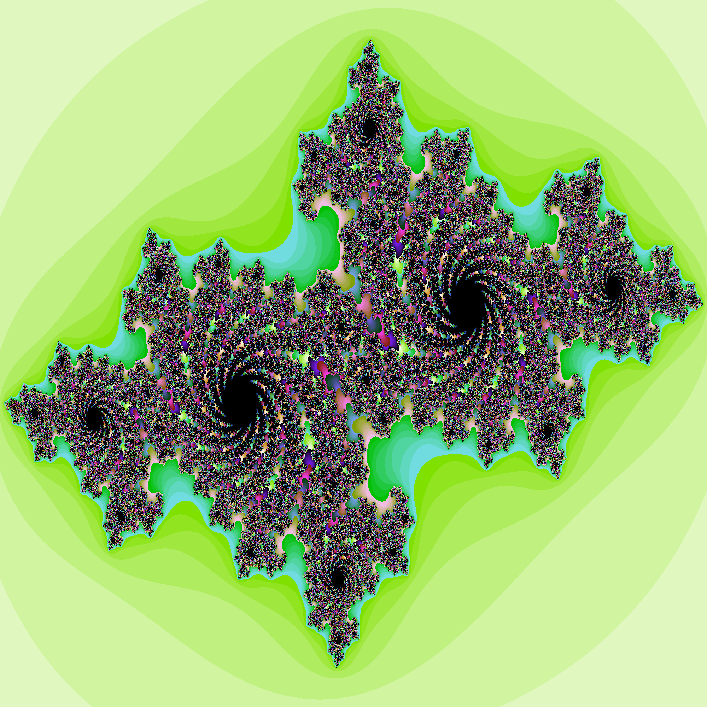

# hs-fractals

Simple command line application for generating fractals, with support for parallelism.

Currently it can generate the mandelbrot set or julia set:

Even though this is a Cabal project, the only dependency that is not available with a [default installation of GHC](https://downloads.haskell.org/ghc/8.10.2/docs/html/users_guide/8.10.2-notes.html#included-libraries) is the [parallel] library.
Thus, this project can be easily adapted to run by using just a standard GHC installation.

[parallel]: https://hackage.haskell.org/package/parallel